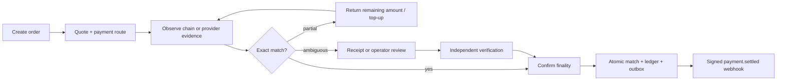
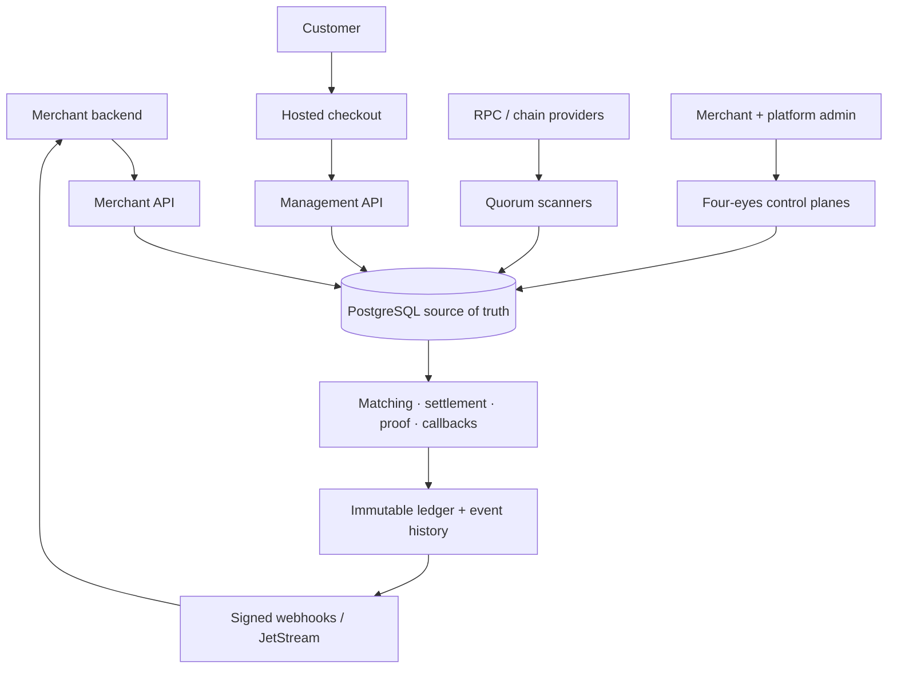

<div align="center">
  
  <h1>ocrypt</h1>
  <p><strong>Programmable, security-first cryptocurrency payments.</strong></p>
  <p>
    Create an order, return an exact crypto amount and payment route, identify the transfer,
    handle partial or excess payments, and deliver a signed settlement event.
  </p>

  [](LICENSE)
  [](https://github.com/calmshv-star/ocrypt/actions/workflows/ci.yml)
  [](backend/go.mod)
  [](tsconfig.base.json)
  [](contracts/openapi.yaml)

  [Documentation](docs/README.md) · [API guide](docs/en/api-integration.md) · [SDKs](sdk/README.md) · [Examples](examples/README.md) · [Security](SECURITY.md)
</div>

---

ocrypt is an open-source, multi-tenant payment platform for websites, bots,
marketplaces, SaaS products, and internal services. It combines a versioned
merchant API, hosted checkout, deterministic blockchain matching, exact-money
accounting, signed webhooks, reconciliation, and an operator control plane in
one auditable system.

The payment core ends at a durable settlement event. Your product keeps control
of users, orders, entitlements, and fulfillment.

> [!IMPORTANT]
> This repository is pre-release infrastructure. Source availability is not
> authorization to process real funds. Review the current
> [implementation status](docs/IMPLEMENTATION_STATUS.md), complete the live
> [acceptance matrix](docs/TEST_PLAN.md), and obtain the legal and operational
> approvals required for your deployment.

## Why ocrypt

| Capability | What it gives you |
| --- | --- |
| Exact payment orders | Fiat amounts, quoted crypto amounts, addresses, expiry, finality, and an opaque hosted-checkout capability |
| Deterministic matching | Network, asset, address, time window, sender evidence, amount proximity, partial aggregation, and explicit ambiguity handling |
| Underpayment and overpayment policy | Merchant-controlled tolerance, exact remaining amount, top-up flow, manual review, and excess-payment evidence |
| Receipt-assisted recovery | Bounded image upload and advisory AI extraction followed by independent on-chain verification—AI cannot settle funds |
| Durable events | Atomic ledger + outbox, signed at-least-once webhooks, event recovery API, and optional JetStream delivery |
| Multi-chain ingestion | EVM, TRON, Solana, TON, and Aptos adapters with quorum, finality, replay, and reorg handling |
| Operational control | Merchant cabinet, platform administration, four-eyes approvals, audit chains, reconciliation, retention, and migration controls |
| Integration choices | Hosted checkout, payment links, direct API, six SDKs, framework examples, and a bounded JSON-MD5/Form-MD5 compatibility service |

## Payment lifecycle



The matcher never credits from a screenshot, client-supplied hash, AI result,
or amount alone. These signals can identify candidates; admitted chain/provider
evidence and finality remain authoritative.

## Architecture



Core invariants:

- PostgreSQL is the operational source of truth.
- Fiat and crypto amounts are integers or exact decimal strings—never floats.
- Settlement, ledger entries, callback creation, and outbox publication share
  atomic transaction boundaries.
- Event identity is stable across retries and re-inclusion while distinct chain
  events remain distinct.
- Reorgs produce compensating evidence; historical financial records are not
  rewritten away.
- Secrets are external references or mounted files, never browser state or
  committed configuration.
- AI is advisory and cannot execute settlement, refunds, treasury, or custody.

## Quick start for contributors

### Prerequisites

- Node.js 22+
- pnpm 11.16+
- the Go version declared in [`backend/go.mod`](backend/go.mod)
- Docker or a compatible container runtime for live PostgreSQL/NATS checks

```bash
pnpm install
pnpm typecheck
pnpm test
pnpm build

cd backend
go test ./...
go vet ./...
```

Run an individual web application with `pnpm dev:landing`, `pnpm dev:admin`,
or `pnpm dev:checkout`. Runtime commands and environment contracts are in
[`backend/README.md`](backend/README.md), [`infra/README.md`](infra/README.md),
and [`deploy/README.md`](deploy/README.md).

`pnpm verify` is the full release admission gate. It intentionally expects
live targets for database, API, sandbox, and browser checks and is not a light
local smoke test.

## Integrate a merchant

1. Create a least-privilege HMAC API credential.
2. Call the versioned create-order/payment-intent endpoint with a stable
   idempotency key.
3. Store the returned payment ID and opaque checkout capability.
4. Show the exact route and crypto amount, or redirect to hosted checkout.
5. Treat `partially_paid` as a top-up workflow using the returned remaining
   amount; route ambiguous cases to receipt/operator recovery.
6. Verify signed webhooks from the raw request body and deduplicate by event ID.
7. Fulfill the customer order only after a durable `payment.settled` event (or
   an authenticated recovery read of the same settled state).

Start with the [API integration guide](docs/en/api-integration.md), the
[OpenAPI contract](contracts/openapi.yaml), and the [webhook examples](examples/README.md).

## SDKs and examples

Official clients share signing vectors, exact-money conventions, stable error
semantics, retry rules, webhook verification, and reconciliation helpers.

| Language | Package |
| --- | --- |
| TypeScript | [`sdk/typescript`](sdk/typescript) |
| Python | [`sdk/python`](sdk/python) |
| Go | [`sdk/go`](sdk/go) |
| PHP | [`sdk/php`](sdk/php) |
| Java | [`sdk/java`](sdk/java) |
| .NET | [`sdk/dotnet`](sdk/dotnet) |

Reference consumers are included for Express/NestJS, FastAPI/Django,
Laravel/Symfony, Spring Boot, ASP.NET, Telegram backends, and generic commerce
systems. They demonstrate raw-body signature verification, an idempotent inbox,
order locking, and a fulfillment outbox.

## Documentation

| Area | Reference |
| --- | --- |
| Documentation index | [`docs/README.md`](docs/README.md) |
| Product and integration guide | [`docs/en/guide.md`](docs/en/guide.md) |
| Merchant API | [`contracts/openapi.yaml`](contracts/openapi.yaml) |
| Management API | [`contracts/management-openapi.yaml`](contracts/management-openapi.yaml) |
| Async events | [`contracts/asyncapi.yaml`](contracts/asyncapi.yaml) |
| Deployment and Helm | [`deploy/README.md`](deploy/README.md) |
| Architecture decisions | [`docs/adr`](docs/adr) |
| Security policy | [`SECURITY.md`](SECURITY.md) |
| Release evidence | [`docs/IMPLEMENTATION_STATUS.md`](docs/IMPLEMENTATION_STATUS.md) |
| Acceptance plan | [`docs/TEST_PLAN.md`](docs/TEST_PLAN.md) |
| Legal boundaries | [`docs/LEGAL.md`](docs/LEGAL.md) |

Public guides are maintained in English, Simplified Chinese, Spanish, French,
German, and Russian. English contracts and message keys are canonical.

## Repository map

```text
apps/admin       Merchant cabinet and platform operations
apps/checkout    Opaque-token hosted checkout and receipt upload
apps/landing     Multilingual product website
backend          Go APIs, domain, ledger, workers, providers, and migrations
contracts        OpenAPI, AsyncAPI, JSON Schemas, and shared vectors
deploy           Hardened images, Helm, roles, policies, and observability
docs             Product, integration, operations, security, and ADRs
examples         Webhook and framework integration examples
infra            Closed-by-default Compose environments
packages/i18n    EN, zh-CN, ES, FR, DE, and RU catalogs
packages/ui      Shared accessible design system
sdk              TypeScript, Python, Go, PHP, Java, and .NET clients
tests            Contract, security, localization, accessibility, and E2E gates
```

## Security

Please do not open public issues containing vulnerabilities, live credentials,
wallet material, customer data, or exploit traffic. Use
[GitHub private vulnerability reporting](https://github.com/calmshv-star/ocrypt/security/advisories/new)
and follow [`SECURITY.md`](SECURITY.md).

## Contributing

Contributions are welcome. Read [`CONTRIBUTING.md`](CONTRIBUTING.md) for domain
boundaries, quality gates, localization requirements, provenance rules, and the
Developer Certificate of Origin-style sign-off expected on commits.

## License

Original ocrypt code and documentation are available under the
[Apache License 2.0](LICENSE), a permissive open-source license with an express
contributor patent grant. Commercial use, modification, distribution, and
private use are permitted subject to its terms.

Redistributions must preserve the license, applicable notices, and
[`NOTICE`](NOTICE), and must mark modified files where required. Third-party
software and adapted material remain under their original licenses; exact known
provenance and attribution are recorded in
[`THIRD_PARTY_NOTICES.md`](THIRD_PARTY_NOTICES.md). Cryptography, sanctions,
payments, custody, privacy, trademarks, external-provider terms, and other
operational legal boundaries are summarized in [`docs/LEGAL.md`](docs/LEGAL.md).
That document is informational and is not legal advice.
